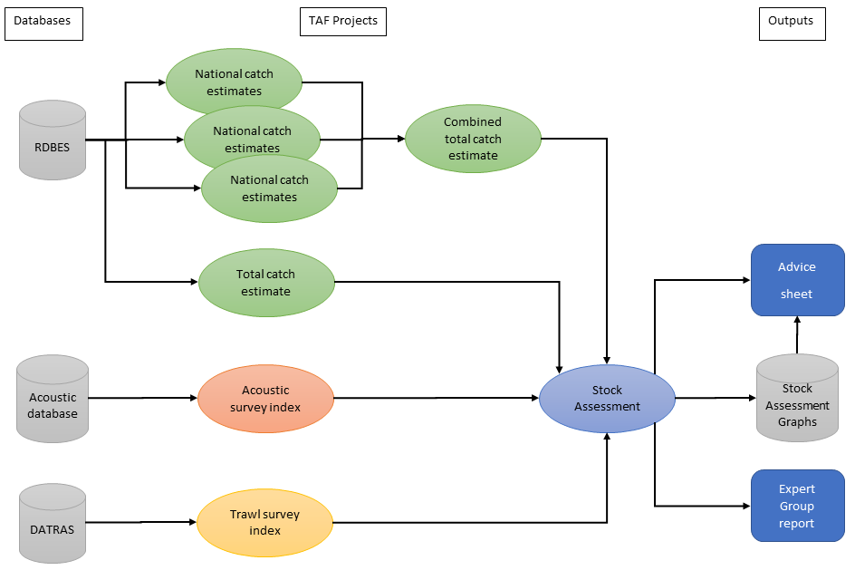

The aim of the Transparent Assessment Framework (TAF) is to assure quality, improve efficiency, and ensure transparency of data and analyses used in the ICES advisory processes.

## Aim / mission statement

### Assuring quality
Assuring quality is a key element of the ICES Advisory Plan (ICES, 2019)[^advisory-plan] and TAF is an essential tool in the overall quality assurance framework. Various quality control check points will be included and documented within TAF.

### Efficiency
ICES experts require a user-friendly framework to archive data, methods, and results used in assessments and advisory products. For recurrent assessments and advice, TAF will ensure that the outputs can be replicated and also be used in future analyses with minimal changes. This will also improve ICES institutional memory as new personnel can more easily understand and pick up the work from earlier contributors.

### Transparency
ICES assessments are carried out using various disparate data sources. TAF will ensure transparent input data processing and reproducible assessment methods, while also automating and documenting the outputs which form the evidence base for advisory products. The aim should be that data are available at the highest possible resolution, taking into account confidentiality constraints on these data.

TAF uses GitHub to share code and data (if allowed by the relevant policy, see below) using repositories. GitHub is a website which uses the Git version control system and allows people to easily share code and data., and all TAF GitHub repositories are found at the ICES TAF GitHub site[^ices-taf]. The development of TAF is steered through the Working Group on the Transparent Assessment Framework Governance (WGTAFGOV)[^wg_WGTAFGOV].

## Historical background

Based on recommendations from the External Review of the Advisory Services (ICES, 2012)[^external-advisory-review], and further elaborated by ACOM, Bureau and the Secretariat, a proposal for investment in resources was approved by ICES Council (2015) noting:

> "The (advisory) system should be optimized by freeing them (assessment scientists) from some of their work (shifting update assessment work to the Secretariat). ICES needs to make a more efficient system and the proposed changes are a good investment in the process."

In 2016 an ‘update assessment’ project was launched, resourced by two full-time professional officers and managed jointly by the Head of Advisory support, and the Head of Data and Information. While the brief was to focus on the reproducibility of single stock (recurrent) assessments, data strategy was also considered an integral part of the development. This evolved the initial idea into what was renamed the Transparent Assessment Framework, with the aim of making:

> "an online open resource of ICES stock assessments for each assessment year. All data input and output is fully traceable and versioned"

TAF has made good progress since its initiation in 2016; it has now reached the adoption stage. In addition to its initial focus on stock assessment, TAF has provided a framework for:

* Spatial fisheries data quality control and data outputs (WGSFD),
* ICES Fisheries Overviews which will be fully implemented within TAF in 2020,
* Management strategy evaluations (WKNSMSE in 2019),
* Mixed fisheries advice (WGMIXFISH).

As part of the 2019 advice plan, one of the key performance indicators is the adoption of TAF within stock assessments. As of January 2020, there are:

* 50 stocks fully implemented in TAF,
* 41 stocks partially implemented.

Of the 260 stocks for which ICES provides advice, the target is to have 200 stocks fully implemented in TAF by 2022.

## Scope

### Definitions

TAF project
: the basic unit with the data and software gathering step (boot) and the analysis scripts (data, model, output, etc.), each project is stored in a single github repository.

TAF (project) Type
: The type of project, typically driven by its purpose, such as, stock assessment, index calculation.

(TAF) pipeline
: a collection of connected TAF projects allowing data to flow from databases through several processes and to a final product, such as an advice narrative or official data product.

Data interfaces
: a bit like a contract, this is the individual file formats a project promises to produce (e.g. SAG stock assessment summaries, or a survey index).  A project can have more than one interface, an example is if a project contains code to run both a stock assessment and the forecasts to produce catch advice.

TAF Server
: where projects are stored and run.

TAF web app
: web application to browse and access code and data products.  Public access is available for projects that have been made public (when an associated advice is published), and access through a login, given appropriate authorization, is required to access projects that are not public and restricted datasets within a project.

TAF GitHub site
: the github.com/ices-taf where the code and some input data of TAF projects are stored. The GitHub repository is how users contribute code and user uploaded datasets to TAF.

### Organisation of TAF projects

A TAF project is a single unit of work following the TAF workflow (data, model, output) that is run on the TAF server and viewable on the TAF web application and on the TAF GitHub site. TAF projects may comprise a range of different data and analysis products, including index calculations, catch-at-age estimates, and assessment runs. The output of one project may be the input of another one, for example, it is often practical to divide a stock assessment into separate projects handling input data processing, the main assessment model run, short-term forecast, etc. A collection of connected TAF projects is called a (TAF) pipeline.
An important task is to keep track of the different TAF projects, and their dependencies and versions. An overview of the different projects will be developed that should include information about linkages between projects, the type of project, the name of the project, as well as the version for any TAF projects used as input.

There is a need for flexibility when setting up a TAF project, because there are a variety of methods, data, and procedures that TAF needs to support. However, there is also a need for structure when the goal is to populate ICES products, e.g., stock assessment results feeding into SAG and Fisheries Overviews, or when a TAF project is set up to provide input to other TAF projects, e.g., the index calculation from fisheries-independent surveys, or catch-at-age data from fisheries-dependent sampling. Standardised and well-documented filenames and field names within TAF projects will be developed where TAF is used for harvesting information, e.g. to populate the SAG and fisheries overviews.

Figure 1. _Example of a data processing pipeline using different TAF projects as building blocks. Note that different configurations of TAF projects may be set up, e.g. to accommodate management strategy evaluations and catch at age estimates directly from the RDBES, avoiding the need for separate TAF projects for each nation._

The type of TAF project determines how much flexibility is allowed, and a list of standard types is developing[^project-types]. Standard output options or data interfaces, including files and metadata field names should be  developed for each main TAF type, starting with the most common ones.

Automated checkers are useful to measure the progress of ongoing TAF projects, for quality control, and subsequent analysis of TAF results. These check the existence of folders and files, metadata, syntax, data values, keywords in the scripts, and allow a grand overview of the status of all TAF projects.

When a TAF project reads data from another TAF project, it should specify the exact version. TAF projects on the TAF server can have access to certain TAF projects without requiring a user password. In many cases, aggregated catch-at-age and survey data should be public on the TAF web application, available to outside systems.

A test case will be developed to get experience in building a pipeline of TAF projects. Some stocks are close to achieving this and should be evaluated before wide implementation.

### Licensing and sensitive data

All code within TAF will be publicly shared on the TAF web application and the TAF GitHub site under open licenses. The licence will adhere to the recommendations from DIG, and should follow the ICES data policy[^ices-data-policy].

Regarding public access to data, note that the policy maintains a list of data collections where the data provider has exerted their right to restrict public access.  This includes data such as:

* Commercial catch data from the Regional Database (RDB), InterCatch, and the Regional Database & Estimation System (RDBES), which have independent data policies;
* VMS and Logbook data, which are governed by the conditions under the specific data call;
* Biodiversity data portal, where data may have been provided by non-governmental organisations;
* Vulnerable Marine Ecosystems (VME) data portal, where location information is sensitive.

It is the responsibility of the corresponding working group to ensure that no confidential data or information are present in the code (e.g. usernames, passwords, or comments that reference vessel names).

Only input data uploaded by the user to TAF that fall under the general ICES Data Policy will be made publicly available on the TAF web application and TAF GitHub repositories. All data within TAF that are under other ICES data policies/licenses (e.g. VMS data) will not be made available on GitHub, but will be retained in a secure location on an ICES computer system and made available through the TAF web application to users with the appropriate authorization. It is the responsibility of the corresponding working group to ensure that no confidential data is uploaded.

All projects should have an explicit and separate licence for data and for code, respectively. This also includes data outputs where the assigned license will define whether they will be publicly available or not.

Access to project outputs will be managed via the ICES secretariat using appropriate technical means.  Access to data and code will be aligned with the business process around the production of advice, i.e. access will be time dependent and user dependent, but will be made public when the advice is published.  Permission to access data collections that have restricted access will be granted based on the specific conditions agreed with the data owner, e.g. countries will need to give specific users access to RDBES data based on the RDBES Data Policy.

Code within TAF is run on the TAF server - a secure ICES computer system - using appropriate credentials. For restricted data, the processing of the data will be done on ICES secure servers with proper security credentials. The system will be set up such that the TAF server will access restricted data when and only when required. For projects with multiple collaborators all collaborators must have access rights to any sensitive data accessible by the project because, through the project, they will have access to the project's data sources by proxy.

### Data interfaces, metadata and data publishing

#### Data interfaces

The data output from a TAF project may be used as input to another TAF project, but also as input to other systems, like the stock assessment graphs, ICES library etc. To accommodate this, the data output needs to follow a standard format. Each TAF type will have the option of providing one or more standard data outputs, allowing the use of the outputs in other systems in addition to another TAF project. The standard outputs also require a set of metadata in addition to the data output itself, see below. The typical user prefers outputs that are easily imported to standard processing software (such as csv), whereas, subsequent data processing would benefit from a machine readable format that contains both metadata and data. This is solved by providing methods that collate the users data files and metadata to provide a separate machine readable format. This allows us to build an efficient end-to-end data processing pipeline to support ICES advice.

#### Metadata

For TAF the metadata will operate on several levels:

1. The TAF project level, describing the overarching goal, and resources
2. Input data, describing the individual data sources used in the subsequent assessment
3. Outputs (data files, machine readable data structures, images, html apps with interactive data visualisations and potentially narratives, e.g. advice, reports.)

The TAF project level is important for organizing the TAF projects. It is recognised that the number of projects could potentially grow very large, and the metadata on the project level is primarily intended to support management, search and filtering of projects. These fields typically include information about the associated working group, year, TAF type, code license, default data product license, with different fields appropriate for different TAF types, such as stock, ecoregion, and survey name.

For input data, the goal is for all ICES-managed data to have fully automatic metadata generation, while data brought in via any other route will have to complete a profile to a given standard. This is to ensure that we can reproduce the outputs. These fields typically include name or title, source - a url or DOI, temporal coverage, spatial coverage, originator, and license - to distinguish what can be published openly.

For outputs, the metadata should contain necessary information to populate landing pages and publication metadata in subsequent systems, including required fields for digital online identifiers (DOIs). For publication to, e.g., SAG, the metadata should complement any metadata already existing in SAG so that the output can be automatically generated. These fields typically include similar fields to input data with the addition of fields for output format, parent TAF project.

To the extent possible, any lists or classifications within the metadata should be driven by vocabularies, hosted on the ICES vocabulary server (unless already published and defined elsewhere).

The TAF metadata convention is published and managed through the WGTAFGOVs GitHub pages.

#### Data publishing

There is a distinction between a project being publicly accessible (e.g. “released”), and data products being actively published (e.g. “published”).

If a subset of a data product from a TAF project is to be published, it is a separate process, much like publishing documents or reports. Alternatively, for the stock assessment TAF type, many of the end results will be published through the Stock Assessment Graphs database[^sag] (SAG), which creates a DOI per stock.

If the entire project (data, model, output) is to be formally published, the suggested metadata profile should support mandatory fields for DataCite DOI publication. However, it is not envisaged that TAF projects are formally published by default.

Both publication and release of data and/or projects needs to be controlled to ensure alignment with advisory processes (e.g. the process of formal advice). It is the

The project-level metadata identifies a project type, which should help guide the publication release/strategy.

### The system will

* work for all analyses that support ICES advisory products
* allow analyses to be rerun quickly
* allow alternative approaches to be archived (i.e., allow multiple assessment runs)
* provide a way to track changes in input data from year to year
* provide a way to track changes in scripts from year to year
* define clear boundaries to other parts of the advisory process
* be R-based (but it can also use R as a wrapper)
* have a user manual and adequate documentation
* support access to the validated final benchmarked model

### The system will not

* archive user code for ad-hoc analyses
* duplicate data publication in other systems, like the SAG
* comment on content of the models

### Governing TAF development and maintenance

The Working Group on the Transparent Assessment Framework Governance (WGTAFGOV) is responsible for governing TAF. The group will review proposed tasks and issues, and identify missing tasks to meet the overarching TAF aims and objectives. Priority should be concentrated in the areas which constitute the bulk of the ICES advice. The first priority would therefore be to ensure that TAF is able to handle the advice on fishing opportunities. This would be closely followed by the Fisheries Overviews that are largely generated using the outputs of the single stock advice and that include mixed fisheries analysis, which would greatly benefit from improved quality assurance. This would be followed by the Ecosystem overviews, other recurrent advice (e.g. advice on bycatch, advice on fishing intensity and pressure, etc)  and finally on non-recurrent advice.  Amongst the latter, it would be particularly important to document advice on the evaluation of Harvest Control Rules through Management Strategy Evaluations.

To meet the objectives it is critical that missing functionality is identified, and both users and WGTAFGOV members are responsible for achieving this. WGTAFGOV members have a particular responsibility to identify functionality that will meet the overarching objectives of TAF, whereas users have a responsibility to identify functionality that meet the needs for their working group. The requests should be submitted directly to the GitHub issue tracker[^issues]. The ICES secretariat will tag, review and refine the request and compose them into manageable tasks. The task list will be maintained through WGTAFGOV’s GitHub pages, and the prioritized task list will be visible through the dashboard[^project-board].

WGTAFGOV will meet 4 times per year to work on the task list and provide guidance on the development. Before each meeting the Secretariat will update the task list and the WGTAFGOV chair will organize the meeting reviewing the proposed tasks. It is expected that the WGTAFGOV members familiarize themselves with any new tasks, and help identify missing tasks for meeting the objectives.

An overview of the available resources will be presented at each WGTAFGOV meeting to ensure a realistic prioritization of the tasks. The secretariat will be an important contributor to the development, but WGTAFGOV should also actively seek involvement from the community. Projects from national institutions that would like to contribute should contact the governance group,and information on how to contribute should be explicitly stated in the GitHub pages.

### Definition of responsibilities

WGTAFGOV is responsible for reviewing and developing the task list, and making prioritizations based on the overall guidelines provided in this document. WGTAFGOV is also to provide oversight management of deliverables related to the TAF system that have been requested as part of the ICES Council equity investment package (2019).

WGTAFGOV reports to the Fisheries Resources Steering Group (FRSG). FRSG will, on behalf of WGTAFGOV, report to ACOM and SCICOM on the development of TAF, and ask for guidance and input that will be passed on to WGTAFGOV for consideration. In general, WGTAFGOV is responsible for the technical implementation, whereas FRSG will provide guidance on the overarching prioritisation on behalf of SCICOM and ACOM.

The secretariat is responsible for hosting and maintaining the TAF system, including the pages on the ICES website, the TAF web application, the TAF server, and the related GitHub repositories.

## Footnotes

[^advisory-plan]: https://issuu.com/icesdk/docs/ices_advisory_plan
[^external-advisory-review]: http://www.ices.dk/sites/pub/Publication%20Reports/Committee%20report/Council/External_Advisory_Review.pdf
[^ices-taf]: https://github.com/ices-taf
[^wg_WGTAFGOV]: https://github.com/ices-eg/wg_WGTAFGOV
[^project-types]: https://taf.ices.dk/repomanager/Dashboard/ProjectTypes
[^ices-data-policy]: https://www.ices.dk/data/guidelines-and-policy/Pages/ICES-data-policy.aspx
[^sag]: https://sg.ices.dk
[^issues]: https://github.com/ices-eg/wg_WGTAFGOV/issues
[^project-board]: https://github.com/ices-eg/wg_WGTAFGOV/projects/1
