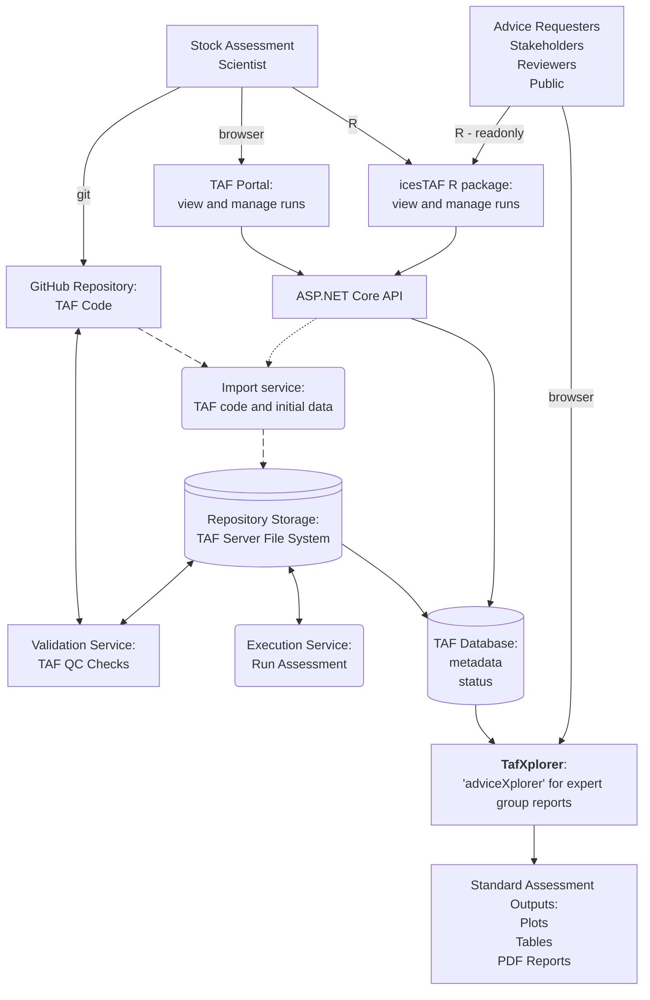

# TAF Architecture

This document contains details on the design of TAF going forward from September 2026.

#### Team composition

The current TAF team is composed of a thematic lead (full time), developer (2 days), student developer (2 days), graphical data scientist (2 days), strategy coordinator (3 days), process (0.5 days), with additional support from the data managent team lead, and developer team lead.

### Document overview

1. High-level business architecture (easy for governance groups)
2. Technical component architecture (for developers)
3. Process flow
4. TAF Analysis Explorer architecture (future vision)
5. Strategic overview

## 1. High level

The stock assessment scientist is provided access to a github repository where they can work and develop thier stock assessment in the TAF format, refered to as `TAF Code`.  See [[TAF format]] for more details.  The TAF code is copied onto the TAF server

